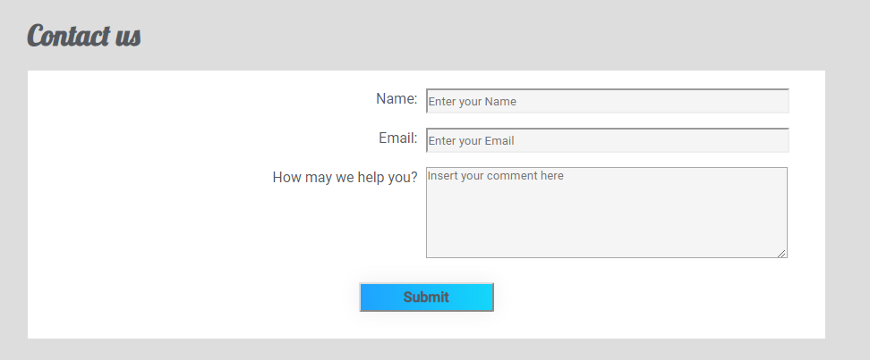
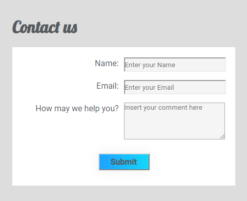

# FCC-Product
A project made to [FreeCodeCamp](https://learn.freecodecamp.org/) to the Responsive Web Design Course.

### Built With
- HTML5 
- CSS3
- JavaScript

**Note:** Project developed from scratch, with a sticky navbar set by JavaScript.

## Images

- Home (1024px)

- Adventures (1024px)

- Contact us (1024px)

- Home (480px)

- Adventures (480px)

- Contact us (480px)

